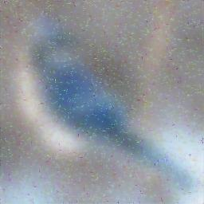
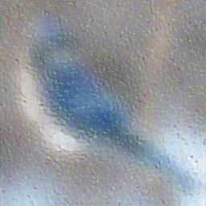
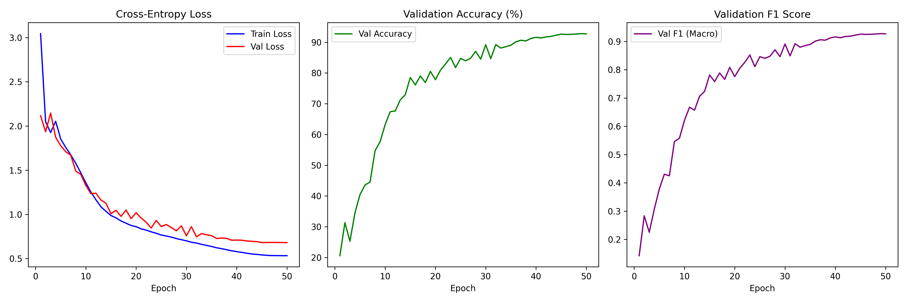
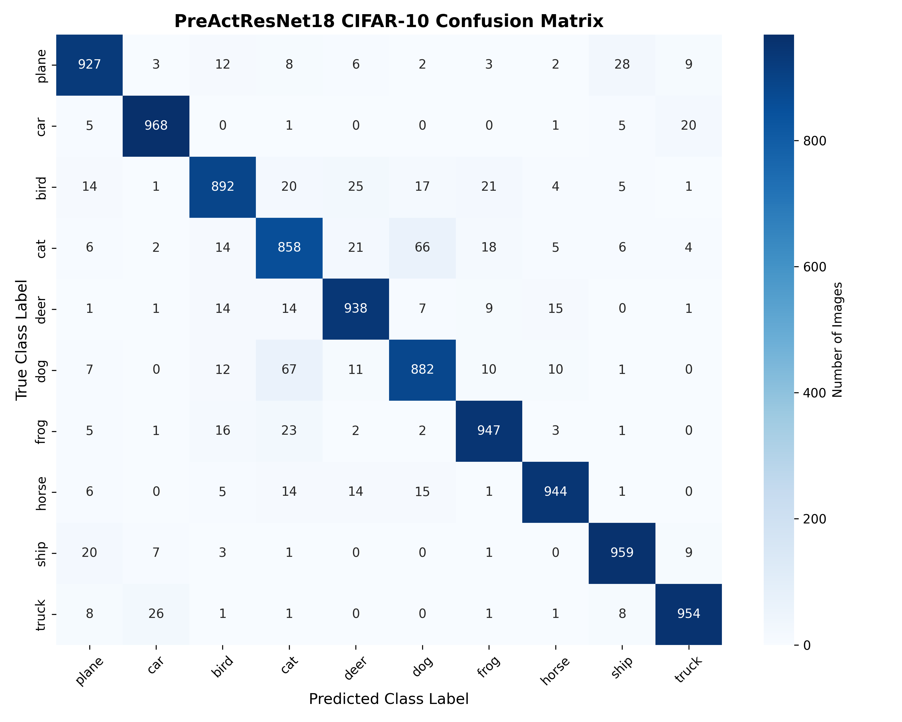

# DIP Final Project: End-to-End Image Restoration & Classification Pipeline

[](https://pytorch.org/)
[](#)
[](#)
[](https://www.kaggle.com/code/amiraliaraghi/dip-final-project?scriptVersionId=337595104)

An end-to-end Deep Learning pipeline developed for the **Digital Image Processing (DIP)** course. Real-world visual data often suffers from complex, compound degradations—such as heavy additive noise paired with severe motion or defocus blur—which severely hamper both human perception and downstream computer vision algorithms. 

To tackle this challenge, this repository introduces a modular, multi-stage restoration and perception pipeline. The system first neutralizes high-frequency noise and recovers spatial structures through deep restoration networks (U-Net and ResNet variants). Once structural clarity is restored, the visual signal is routed to an optimized **PreActResNet-18** classifier trained on the **CIFAR-10** dataset. By bridging low-level image restoration with high-level semantic classification, this project demonstrates how deep learning can effectively recover lost semantic information from heavily corrupted inputs.

> **📌 Interactive Notebook & Live Results on Kaggle**  
> You can view, run, and inspect the full executed notebook, training logs, intermediate visualizations, and complete evaluation metrics directly on Kaggle:  
> 👉 **[Open Final Project Notebook on Kaggle](https://www.kaggle.com/code/amiraliaraghi/dip-final-project?scriptVersionId=337595104)**


---

## Pipeline Overview

The pipeline operates sequentially across three core phases:
```text
[Corrupted Image] ---> Phase 1: Denoising (U-Net) ---> Phase 2: Deblurring (ResNet/U-Net) ---> Phase 3: Classification (PreActResNet-18) ---> [Final Output: Bird (68.03%)]
```

1. **Phase 1 - Image Denoising:** Employs a custom U-Net architecture to suppress high-frequency additive noise while preserving structural contours.
2. **Phase 2 - Image Deblurring:** Utilizes Residual Networks (ResNet/U-Net) with skip connections to restore high-frequency details, sharp edges, and eliminate ringing artifacts.
3. **Phase 3 - Image Classification:** Classifies the restored target image using a PreActResNet-18 model trained with PyTorch Automatic Mixed Precision (AMP FP16) on Multi-GPU hardware, exported as a standalone **TorchScript (`.pt`)** module.

---

## Project Structure

```text
.
├── noisy_inputs/
│   └── corrupted_image.jpeg          # Original corrupted input image
├── original_inputs/
│   └── original_image.jpeg            # Clean reference image
├── phase_1_results/
│   └── denoised_image.jpeg           # Denoised output from Phase 1 U-Net
├── phase_2_results/
│   ├── deblurred_image.jpeg          # Final deblurred output from Phase 2
│   ├── deblurred_resnet.jpeg         # Deblurred output via ResNet architecture
│   └── deblurred_unet.jpeg           # Deblurred output via U-Net architecture
├── PreActResNet_training_metrics.png # Training Loss, Accuracy, and F1 curves
├── cifar10_confusion_matrix.png      # PreActResNet-18 evaluation confusion matrix
├── notebook.ipynb                    # Complete end-to-end execution notebook
├── requirements.txt                  # Python dependencies
├── LICENSE                           # MIT License
└── .gitignore                        # Git exclusion rules
```

---

## Visual Pipeline Results

### Phase 1 & 2: Image Restoration Sequence

| Input Corrupted Image | Phase 1: Denoised Output | Phase 2: Deblurred Output |
| :---: | :---: | :---: |
|  |  |  |

---

## Phase 3: Classification & Model Performance

### Classifier Specifications
* **Architecture:** PreActResNet-18
* **Dataset:** CIFAR-10 (10 Classes, 32x32 resolution)
* **Training Setup:** 50 Epochs | Batch Size: 256 | Multi-GPU `DataParallel` (2x NVIDIA GPUs)
* **Optimization:** SGD (`lr=0.1`, `momentum=0.9`, `weight_decay=5e-4`) with `CosineAnnealingLR`
* **Regularization & Precision:** Label Smoothing (0.1), Advanced Augmentations (RandomCrop, HorizontalFlip, GaussianBlur), PyTorch AMP FP16 (`torch.amp.autocast('cuda')`).

### Training Metrics & Confusion Matrix

| Learning Curves | Confusion Matrix |
| :---: | :---: |
|  |  |

### End-to-End Pipeline Inference Output

```text
==================================================
      FINAL RESTORATION PIPELINE INFERENCE        
==================================================
Top-5 Predictions:
--------------------------------------------------
1. bird       : 68.03%  [PREDICTED]
2. cat        : 15.36%
3. ship       : 4.46%
4. plane      : 2.61%
5. car        : 2.19%
--------------------------------------------------
Ground Truth Class : bird
Final Prediction   : bird (68.03%)
==================================================
SUCCESS: Semantic information successfully recovered!
```

---

## Key Technical Features

* **Skip Connection Advantage:** Preservation of fine spatial resolution and edge gradients during deep feature extraction.
* **Mixed Precision Acceleration:** Utilized `torch.amp.autocast('cuda')` and `GradScaler('cuda')` for memory efficiency and faster convergence.
* **Production Export:** Exported the final model to standalone TorchScript format (`.pt`) via `torch.jit.trace` for fast deployment without Python runtime dependencies.

---

## Getting Started

### Prerequisites

* Python 3.8+
* CUDA-compatible GPU environment

### Installation

1. Clone the repository:
   ```bash
   git clone [https://github.com/osumy/DIP-Final-Project.git](https://github.com/osumy/DIP-Final-Project.git)
   cd DIP-Final-Project
   ```

2. Install dependencies:
   ```bash
   pip install -r requirements.txt
   ```

3. Run the complete pipeline notebook:
   Execute `notebook.ipynb` sequentially using Jupyter Notebook, JupyterLab, or Kaggle.

---

## License

This project is licensed under the MIT License - see the [LICENSE](LICENSE) file for details.
